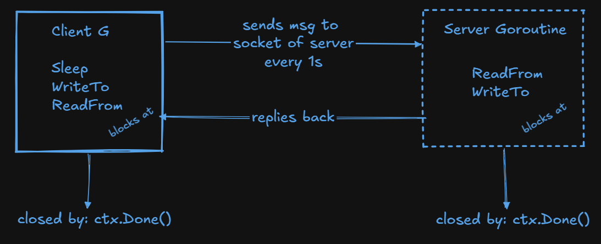

## echo server

a toy udp server made to echo your message back to your socket.

when running the program, it automatically initializes a "client" socket connection which sends random words to the "server" socket.

the server uses go's goroutines for concurrency, you can test this out by sending a datagram to the socket the server is running on:

```bash
echo "hey im a new client" | nc -u 127.0.0.1 PORT_THE_SERVER_IS_LISTENING_ON
```

graceful termination is handled. (with context lib)

a nice visualization of the the "threads" (actually goroutines) within this program



## how to reason about concurrent applications (note)

Rob Pike basically defines concurrency as the composition of independently executing computations
so to understand it better:

- first: draw each individual "thread" as a box and _reason sequentially inside of the concurrent "threads", hence, `communicating sequential processes`_
- second: circle out where each program blocks, and how to release it. the diagram above does that.
  - a common source of bugs in concurrent go code is creating a goroutine which never exits, creating a `goroutine leak`
- third: draw ownership. Let's take a map for example.
  - go encourages _one goroutine owning a resource (the map) and other goroutines sending requests to it concurrently_
  - you can also work via mutexes and locks, but go encourages thinking in terms of communication via channels instead of shares resources.
- fourth: reason about and explain the lifetime, who starts which goroutine, what it blocks on, and where it dies

## stuff learned

context.Context, graceful cancellation, goroutines, concurrency, error handling, socket programming, net lib, communication via udp, fmt package, when to use log vs fmt,

## todo

implement a welcome message, so every time a datagram is recieved from a new client endpoint, it should send them a welcome message (make this thing stateful)

